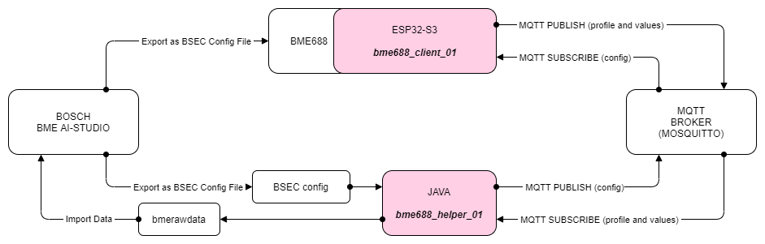

# MOTH.BME.1

This is a POC project providing a generic integration example for the Adafruit Bosch BME688 Sensor.

## [bme688_device_01](bme688_device_01/README.MD)

A short description of the hardware used.

## [bme688_client_01](bme688_client_01)

The Arduino sketch. Please see the [device configuration](bme688_client_01/BoxConf.h) for configuration you will have to provide to suit your wifi and MQTT setup.

Libraries used in the sketch:

- Wire at version 2.0.0
- LittleFS at version 2.0.0
- FS at version 2.0.0
- SPI at version 2.0.0
- Adafruit GFX Library at version 1.11.7
- Adafruit BusIO at version 1.14.1
- Adafruit SSD1306 at version 2.5.7
- WiFi at version 2.0.0
- RTClib at version 2.1.1
- ArduinoJson at version 5.13.5
- PubSubClient at version 2.8
- BME68x Sensor library at version 1.1.40407
- BSEC2 Software Library at version 1.5.2400

## [bme688_helper_01](bme688_helper_01)

A simple Java helper app. As the device publishes its heater profile and the measured sensor data, the client continuously writes a bmerawdata file, which can be imported into the [BME AI-Studio Desktop]https://www.bosch-sensortec.com/software-tools/software/bme688-software/ software provided by Bosch.

## [Mosquitto](https://mosquitto.org/)

Communication between the bme-client and the bme-helper is through MQTT. You will need a MQTT Broker and configure the bme-client and the bme-helper to use this broker. I am using a basic installation of Mosquitto on Windows.

## Communication

The sketch below attempts to illustrate how the components needed for this project are connected.

